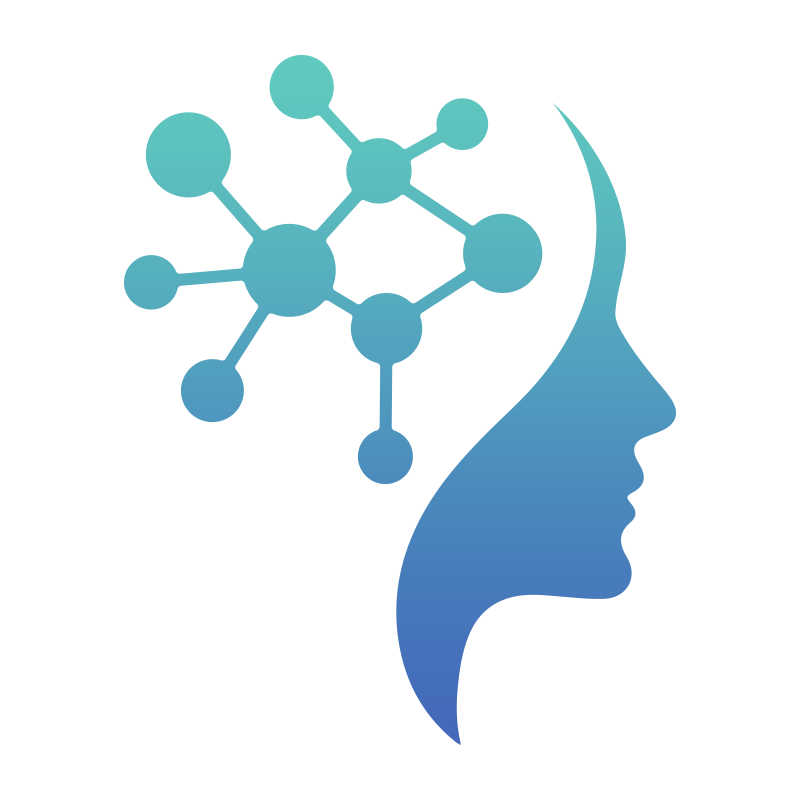

<div align="center">
  

# Knowledge Graph Brain
</div>

**An early-stage, composable knowledge graph system for building structured, traceable GraphRAG and agent workflows across multiple data sources.**

> **Project Status: Experimental / Pre-release**
> This project is under active development. APIs, schemas, and configuration may change between versions. It is designed for experimentation and extension, not turnkey deployment.

---

## What It Does

Knowledge Graph Brain provides building blocks for assembling trustworthy RAG and agent systems:

- **Connect** multiple systems (Confluence, GitHub, Slack, etc.) using declarative YAML schemas
- **Ingest** data into Neo4j with vector embeddings and explicit provenance tracking
- **Query** using hybrid GraphRAG techniques that combine semantic search with graph traversal
- **Expose** capabilities as MCP tools or REST/OpenAPI endpoints
- **Persist** registered schemas to Neo4j so they survive restarts
- **Prototype connectors** visually from OpenAPI specifications with AI-assisted scaffolding

The project emphasizes transparency in how knowledge is represented, transformed, and retrieved.

---

## Prerequisites

- **Node.js 18+**
- **Neo4j 5** — via [Neo4j Desktop](https://neo4j.com/download/) or Docker
- **Ollama** — for local embeddings (`ollama pull mxbai-embed-large`) and LLM (`ollama pull qwen3:8b`)

---

## Quick Start

```bash
# 1. Clone and install
git clone https://github.com/ryandmonk/knowledge_graph_brain.git
cd knowledge_graph_brain

# 2. Configure environment
cp .env.example .env
# Edit .env with your Neo4j credentials and preferences

# 3. Install dependencies
cd orchestrator && npm install && cd ..
cd connectors/retail-mock && npm install && cd ../..

# 4. Start services (requires Neo4j running + Ollama for embeddings)
./start-services.sh

# 5. Register a schema and ingest demo data
curl -X POST http://localhost:3000/api/register-schema-yaml \
  -H "Content-Type: application/json" \
  -d @- <<'EOF'
{
  "kb_id": "retail-demo",
  "yaml_content": "$(cat examples/retail.yaml)"
}
EOF

curl -X POST http://localhost:3000/api/ingest \
  -H "Content-Type: application/json" \
  -d '{"kb_id":"retail-demo","source_id":"products"}'

# 6. Query your graph
curl -X POST http://localhost:3000/api/search-graph \
  -H "Content-Type: application/json" \
  -d '{"kb_id":"retail-demo","cypher":"MATCH (p:Product) RETURN p LIMIT 5"}'
```

See the full [Setup Guide](./docs/DEPLOYMENT.md) for environment configuration and troubleshooting.

---

## Web Setup Wizard

A lightweight React-based setup UI is included for exploration and local development:

```bash
cd web-ui && npm install && npm run dev
# Then open http://localhost:3100
# Or access via the orchestrator at http://localhost:3000/ui (after building)
```

Features include:
- Service health visibility for Neo4j, connectors, and ingestion status
- Visual configuration for schemas and connectors
- Demo mode using mock data
- 3D graph visualization

This UI is a development and learning aid, not a finished administration console.

---

## Docker

```bash
# Start Neo4j, Ollama, orchestrator, and all connectors
docker compose -f infra/docker-compose.yml up

# Neo4j Browser: http://localhost:7474
# Orchestrator:  http://localhost:3000
```

The Docker Compose setup includes health checks and waits for Neo4j to be ready before starting the orchestrator.

---

## MCP and API Integration

Knowledge Graph Brain includes a Universal MCP Server that exposes system capabilities as tools:

- **Knowledge access**: `ask_knowledge_graph`, `search_semantic`, `explore_relationships`
- **Lifecycle management**: `list_knowledge_bases`, `add_data_source`, `start_ingestion`
- **Schema exploration**: `explore_schema`, `find_patterns`, `get_overview`

Compatible with MCP clients including Open WebUI, Claude Desktop, and VS Code MCP extensions.

The same surface can be exposed as REST/OpenAPI:

```bash
cd mcp-server && npm run build
../.venv/bin/mcpo --port 8080 -- node ./dist/index.js
open http://localhost:8080/docs
```

See the [MCP and OpenAPI Integration Guide](./docs/openapi-integration.md) for details.

---

## Documentation

- [Architecture](./docs/ARCHITECTURE.md)
- [Deployment Guide](./docs/DEPLOYMENT.md)
- [Connectors Matrix](./connectors/README.md)
- [Schema DSL Reference](./docs/dsl.md)
- [GraphRAG Guide](./docs/graphrag.md)
- [CLI Tools](./docs/cli.md)
- [API Reference](./docs/API.md)
- [Troubleshooting](./TROUBLESHOOTING.md)

---

## Testing

```bash
# Unit tests
cd orchestrator && npm test

# E2E tests (requires running services)
cd tests/e2e && ./run-tests.sh smoke
```

Coverage focuses on schema parsing, connector mapping, idempotent ingestion, and UI smoke tests. This test suite supports refactoring and iteration, not production certification.

---

## Roadmap

- [ ] Additional connectors (Jira, Google Drive, Notion)
- [ ] Interactive graph exploration in the Web UI
- [ ] Schema-driven tool suggestion
- [x] Schema persistence to Neo4j
- [x] End-to-end testing harness
- [ ] Evaluation and quality scoring framework
- [ ] Published npm package / Docker image

---

## What This Project Is Not

- A turnkey enterprise search product
- A hosted SaaS offering
- A compliance-certified or security-audited system
- A drop-in replacement for a vector database

Knowledge Graph Brain is best suited for system builders, researchers, and teams exploring structured approaches to RAG and agent memory.

---

## License

Apache 2.0. See [LICENSE](./LICENSE).

---

## Support and Contributing

- Open an issue for bugs or feature requests
- See [CONTRIBUTING.md](./CONTRIBUTING.md) for development setup
- Testing documentation lives in [TESTING.md](./TESTING.md) and the E2E guide
