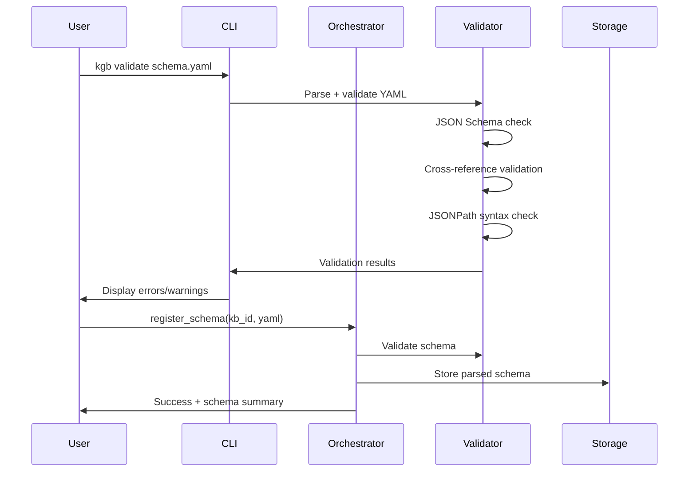
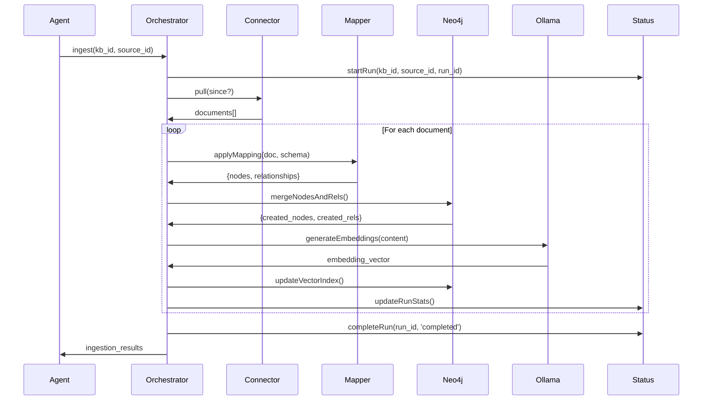
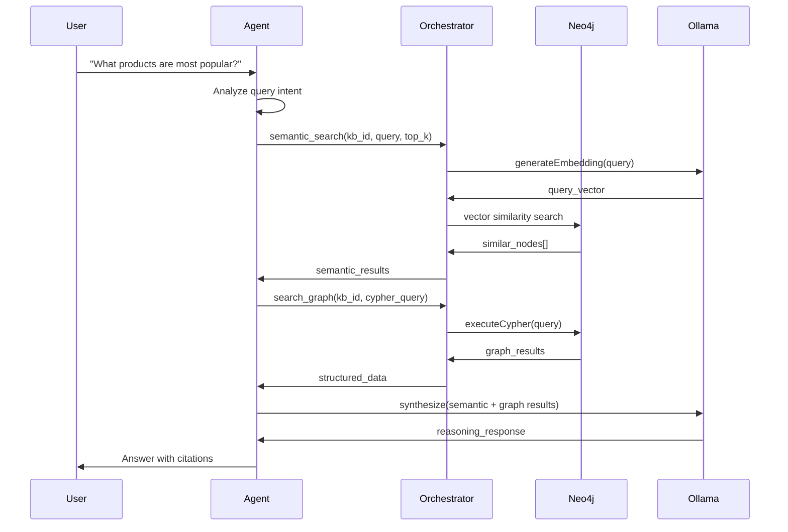

# Architecture Documentation

Knowledge Graph Brain is a production-ready system for building intelligent knowledge graphs with trustworthy RAG capabilities.

## System Overview

Knowledge Graph Brain transforms siloed data sources into a unified, queryable knowledge graph with full provenance tracking and intelligent question-answering capabilities.

### Core Principles

- **🔒 Privacy-First**: Complete local operation with Ollama (no external API dependencies)
- **📋 Trustworthy**: Full provenance tracking with source attribution and citations  
- **🔧 Production-Ready**: Enterprise-grade architecture with proper error handling, logging, and monitoring
- **🔌 Extensible**: Pluggable connectors, embedding providers, and schema definitions
- **🧠 Intelligent**: Hybrid semantic + graph search with multi-step AI reasoning

---

## High-Level Architecture

```
                                    Knowledge Graph Brain
    ┌─────────────────────────────────────────────────────────────────────────────────────┐
    │                                                                                         │
    │   ┌─────────────────┐    ┌──────────────────┐    ┌─────────────────┐                 │
    │   │   Data Sources  │────│   Orchestrator   │────│    Neo4j DB     │                 │
    │   │ • Confluence    │    │ • Schema Parser  │    │ • Graph Data    │                 │
    │   │ • Retail APIs   │    │ • MCP Server     │    │ • Embeddings    │                 │
    │   │ • Custom APIs   │    │ • Ingest Engine  │    │ • Provenance    │                 │
    │   │ • Databases     │    │ • Status Tracker │    │ • Vector Index  │                 │
    │   └─────────────────┘    └──────────────────┘    └─────────────────┘                 │
    │                                   │                                                    │
    │                          ┌──────────────────┐                                        │
    │                          │  LangGraph Agent │                                        │
    │                          │ • Semantic Search│                                        │
    │                          │ • Graph Queries  │                                        │
    │                          │ • Smart Synthesis│                                        │
    │                          │ • Ollama LLM     │                                        │
    │                          └──────────────────┘                                        │
    │                                                                                        │
    └────────────────────────────────────────────────────────────────────────────────────┘
                                           │
                           ┌───────────────┼───────────────┐
                           │               │               │
                      ┌─────────┐    ┌──────────┐    ┌──────────┐
                      │   CLI   │    │ REST API │    │ MCP API  │
                      │  Tools  │    │ Clients  │    │ Agents   │
                      └─────────┘    └──────────┘    └──────────┘
```

---

## Component Architecture

### 1. Orchestrator (Core Engine)

The orchestrator is the central coordination engine built with TypeScript and Node.js.

**Location**: `/orchestrator/`

**Key Modules**:
```
orchestrator/src/
├── index.ts              # Express server + MCP endpoint
├── capabilities/         # MCP tool implementations  
│   └── index.ts          # 6 core capabilities
├── dsl/                  # Schema processing
│   ├── index.ts          # YAML parser + JSONPath mapper
│   └── validator.ts      # Comprehensive schema validation
├── ingest/               # Data processing pipeline
│   └── index.ts          # Neo4j merging + embeddings
├── connectors/           # Data source integrations
│   └── index.ts          # Connector client abstraction
├── embeddings/           # AI/ML integrations
│   └── index.ts          # Ollama + OpenAI providers
├── migrations/           # Database management
│   └── runner.ts         # Automated constraint setup
└── status/               # Operational monitoring
    └── index.ts          # Run tracking + health checks
```

**Core Responsibilities**:
- **MCP Server**: Exposes 6 capabilities via Model Context Protocol
- **REST API**: Simple HTTP endpoints for testing and monitoring
- **Schema Processing**: YAML DSL parsing with JSONPath field extraction
- **Data Ingestion**: Orchestrates connector → mapping → Neo4j pipeline
- **Status Tracking**: Comprehensive operational monitoring and run statistics

### 2. Neo4j Database (Knowledge Graph)

Neo4j 5+ serves as the central knowledge graph with vector search capabilities.

**Schema Design**:
```cypher
// Node structure with provenance
(:Node {
  id: "unique-id",
  kb_id: "knowledge-base-id", 
  source_id: "data-source-id",
  run_id: "ingestion-run-id",
  created_at: timestamp,
  updated_at: timestamp,
  // Dynamic properties based on schema
})

// Relationship structure with provenance  
()-[:RELATIONSHIP {
  kb_id: "knowledge-base-id",
  source_id: "data-source-id", 
  run_id: "ingestion-run-id",
  created_at: timestamp
}]-()

// Vector embeddings for semantic search
CREATE VECTOR INDEX embedding_index 
FOR (n:Node) ON (n.embedding)
OPTIONS {indexConfig: {
  `vector.dimensions`: 1024,
  `vector.similarity_function`: 'cosine'
}}
```

**Key Features**:
- **Full Provenance**: Every node/relationship tracks kb_id, source_id, run_id, timestamps
- **Vector Search**: Semantic similarity using Ollama embeddings (1024 dimensions)
- **Constraints**: Unique constraints per knowledge base to prevent duplicates
- **Indexing**: Performance indexes on kb_id, source_id for fast filtering

### 3. LangGraph Agent (AI Reasoning)

Intelligent question-answering agent with multi-step reasoning capabilities.

**Location**: `/langgraph/graph_rag_agent/`

**Core Components**:
```typescript
// Agent Tools
- semantic_search: Vector similarity search
- search_graph: Cypher query execution

// Reasoning Flow
1. Query Analysis → Determine search strategy
2. Information Gathering → Use tools to collect evidence  
3. Evidence Synthesis → Combine results with citations
4. Response Generation → Structured answer with provenance
```

**Integration Points**:
- **Local LLM**: Ollama qwen3:8b for reasoning (privacy-first)
- **Embeddings**: mxbai-embed-large for semantic search
- **Knowledge Graph**: Direct Neo4j queries via search_graph tool
- **MCP Protocol**: Seamless integration with orchestrator capabilities

### 4. Data Connectors (Source Integration)

Pluggable connectors for various data sources with standardized interfaces.

**Architecture**:
```typescript
interface Connector {
  // Pull data with optional incremental sync
  pull(since?: string): Promise<{
    documents: Document[],
    cursor?: string
  }>;
  
  // Test connection and authentication
  healthCheck(): Promise<boolean>;
}
```

**Current Implementations**:
- **Confluence**: Real Confluence Cloud API with authentication
- **Retail Mock**: Demonstration connector with sample product data

**Future Connectors**:
- Notion, Slack, GitHub, Databases, File systems, REST APIs

### 5. CLI Tools (Developer Experience)

Professional command-line tools for schema validation and system monitoring.

**Location**: `/cli/`

**Commands**:
```bash
kgb validate schema.yaml    # Schema validation with error reporting
kgb status                  # System health and KB monitoring  
kgb status --kb-id my-kb   # KB-specific status
kgb status --runs          # Recent ingestion runs
```

**Integration**:
- **Schema Validation**: Uses same validator as orchestrator
- **Status API**: Queries orchestrator REST endpoints
- **Professional UX**: Color output, verbose modes, JSON format

---

## Dynamic Schema Architecture (v1.2.0+)

### Overview

Knowledge Graph Brain implements a **completely dynamic schema management system** that enables unlimited data source integration without code changes. This architecture represents a major milestone in the system's evolution from a demo platform to a production-ready, infinitely scalable knowledge graph solution.

### Key Components

#### 1. Schema Registry (`registeredSchemas` Map)

The central schema storage system that maintains all registered knowledge base schemas in memory:

```typescript
// In capabilities/index.ts
export const registeredSchemas: Map<string, Schema> = new Map();

// Schema registration stores parsed schemas
registeredSchemas.set(kb_id, parsedSchema);
```

**Benefits**:
- ✅ **Zero Hardcoding**: No schemas embedded in source code
- ✅ **Runtime Registration**: Schemas can be added/updated without deployments  
- ✅ **Multi-tenant**: Each knowledge base maintains isolated schema
- ✅ **Memory Efficient**: Fast lookup with Map-based storage

#### 2. Dynamic Connector Resolution

Connector URLs are resolved dynamically from schema mappings instead of hardcoded logic:

```yaml
# Schema defines connector URLs
mappings:
  sources:
    - source_id: "products"
      connector_url: "http://localhost:8081/data/products"  # Dynamic resolution
      document_type: "product"
      # ... rest of mapping
```

**Before (v1.1.x - Hardcoded)**:
```typescript
// ❌ Hardcoded connector logic (removed in v1.2.0)
if (source_id === 'products') {
  connectorUrl = 'http://localhost:8081/data/products';
} else if (source_id === 'confluence') {
  connectorUrl = 'http://localhost:3001/pull';
}
```

**After (v1.2.0+ - Dynamic)**:
```typescript
// ✅ Dynamic connector resolution from schema
const mapping = schema.mappings.sources.find(s => s.source_id === source_id);
const connectorUrl = mapping.connector_url;
```

#### 3. Schema-Agnostic Ingestion Pipeline

The data ingestion process is completely driven by registered schemas:

```typescript
// Dynamic schema lookup
const schema = registeredSchemas.get(kb_id);
if (!schema) {
  throw new Error(`No schema registered for kb_id: ${kb_id}`);
}

// Dynamic connector resolution
const mapping = schema.mappings.sources.find(s => s.source_id === source_id);
const connectorUrl = mapping.connector_url;

// Schema-driven data processing
const extractedData = applyMapping(document, mapping);
```

### Scalability Benefits

#### Unlimited Data Sources

Adding a new data source requires **zero code changes**:

1. **Create Connector**: Implement data source API
2. **Define Schema**: Create YAML with `connector_url` mapping  
3. **Register Schema**: POST to `/api/register-schema`
4. **Ingest Data**: POST to `/api/ingest` - works automatically

#### Example: Adding Slack Integration

```yaml
# New schema - no orchestrator code changes needed
kb_id: slack-conversations
mappings:
  sources:
    - source_id: "channels"
      connector_url: "http://localhost:9000/slack/channels"
      document_type: "channel"
      extract:
        node: Channel
        assign:
          id: "$.id"
          name: "$.name"
```

#### Enterprise Deployment Flexibility

Different environments can use different connector URLs without code changes:

```yaml
# Development
connector_url: "http://localhost:8080/api/data"

# Staging  
connector_url: "http://staging-api.company.com/data"

# Production
connector_url: "https://api.company.com/data"
```

### Migration Impact

The transition from v1.1.x to v1.2.0 eliminated approximately **200 lines of hardcoded schema logic**:

**Removed Components**:
- Hardcoded retail schema definitions
- Hardcoded confluence schema definitions  
- If/else connector URL resolution logic
- Static schema imports

**Added Components**:
- Dynamic `registeredSchemas` Map integration
- Schema persistence in registration endpoint
- Dynamic connector URL resolution
- Enhanced schema validator with `connector_url` support

This dynamic architecture transforms Knowledge Graph Brain from a demo system into a truly **production-ready, infinitely scalable platform** for enterprise knowledge graph deployment.

---

## Data Flow Architecture

### Schema Registration Flow



### Data Ingestion Flow



### Query Processing Flow



---

## Security Architecture ⭐ **Enterprise Implementation v0.19.0+**

### Authentication & Authorization

**Production Ready**: Complete RBAC system with audit trails and compliance monitoring

```typescript
// Production security implementation
interface SecurityContext {
  user_id: string;
  roles: string[];
  kb_permissions: {
    [kb_id: string]: Permission[]
  };
  session: {
    id: string;
    expires: Date;
    ip: string;
  };
}

interface AccessControl {
  users: User[];
  roles: Role[];
  permissions: Permission[];
}

interface User {
  id: string;
  email: string;
  name: string;
  roles: string[];
  status: 'active' | 'disabled';
  kbAccess: string[]; // KB-scoped access
  lastLogin: Date;
}

interface Role {
  id: string;
  name: string;
  description: string;
  permissions: string[];
  userCount: number;
}

enum Permission {
  READ = 'read',
  READ = 'read',
  WRITE = 'write', 
  ADMIN = 'admin',
  AUDIT = 'audit',
  SECURITY = 'security'
}
```

### **Enterprise Security Features** ⭐ **v0.19.0+**

**Security Dashboard**: Complete security posture monitoring
- **8 Security Checks**: Password security, network security, authentication config, data encryption, input validation, access controls, audit logging, dependency security
- **Compliance Frameworks**: OWASP, NIST, ISO27001 monitoring with scoring
- **Vulnerability Management**: Automated scanning with mitigation tracking
- **Security Score**: Real-time calculation with 63% baseline score

**Configuration Audit**: Complete audit trail system
- **Change Tracking**: All configuration modifications with user attribution and timestamps
- **Event Logging**: Authentication and authorization events via Neo4j integration
- **Security Alerts**: Automated incident detection with severity classification
- **Analytics**: Daily activity patterns and event type breakdowns

**Access Control Management**: Production RBAC implementation
- **User Lifecycle**: Create, edit, disable users with audit preservation
- **Role Management**: Comprehensive role assignment with permission visualization
- **KB-Scoped Permissions**: Granular access control per knowledge base
- **Real-Time Validation**: Live permission checking and enforcement

### Data Security

**Encryption**:
- TLS/SSL for all network communications
- Encrypted storage for sensitive connector credentials
- Optional database encryption at rest

**Network Security**:
- Internal service communication via Docker networks
- Firewall rules limiting external access
- Neo4j bolt protocol security

**Privacy Protection**:
- Complete local operation with Ollama (no external API calls)
- PII detection and warnings during schema validation
- Configurable data retention policies

---

## Performance Architecture

### Scalability Patterns

**Horizontal Scaling**:
```
┌─────────────────┐    ┌─────────────────┐
│  Orchestrator   │    │  Orchestrator   │
│   Instance 1    │    │   Instance 2    │
└─────────────────┘    └─────────────────┘
         │                       │
         └───────────┬───────────┘
                     │
          ┌─────────────────┐
          │     Neo4j       │
          │   (Clustered)   │
          └─────────────────┘
```

**Caching Strategy**:
- In-memory caching for frequently accessed schemas
- Query result caching for expensive graph operations
- Embedding caching to avoid recomputation

**Performance Optimizations**:
```cypher
// Strategic indexes for fast queries
CREATE INDEX kb_node_index FOR (n:Node) ON (n.kb_id, n.source_id);
CREATE INDEX relationship_kb_index FOR ()-[r]-() ON (r.kb_id);
CREATE VECTOR INDEX embedding_index FOR (n:Node) ON (n.embedding);

// Query optimization patterns
MATCH (n:Node {kb_id: $kb_id})
WHERE n.embedding IS NOT NULL
CALL db.index.vector.queryNodes('embedding_index', $top_k, $query_vector)
YIELD node, score
RETURN node, score
```

### Resource Planning

**Memory Requirements**:
- **Neo4j**: 2-4GB heap + 2GB page cache for medium datasets
- **Orchestrator**: 512MB-2GB depending on concurrent ingestion
- **Ollama**: 4-8GB for embedding model + LLM model

**Storage Requirements**:
- **Graph Data**: ~100-500MB per 100k nodes (varies by properties)
- **Vector Index**: ~4KB per node for 1024-dim embeddings  
- **Logs/Backups**: Plan for 20-50% additional storage

---

## Monitoring Architecture ⭐ **Real-Time Implementation v0.18.0+**

### **Production Monitoring Stack**

**Real-Time WebSocket Monitoring**:
```typescript
// Production WebSocket metrics (ws://localhost:3000/ws/monitoring)
interface RealTimeMetrics {
  cpu: number;           // Current CPU usage %
  memory: number;        // Memory usage MB
  responseTime: number;  // Average response time ms
  errorRate: number;     // Error rate %
  services: {
    [service: string]: 'healthy' | 'warning' | 'error'
  };
  timestamp: string;
}

// 5-second broadcast intervals with 24-hour data retention
```

**Service Health Monitoring**:
```typescript
// Individual service monitoring with dependency tracking
interface ServiceMetrics {
  name: string;
  status: 'healthy' | 'warning' | 'error';
  port: number;
  cpu: number;
  memory: number;
  uptime: string;
  responseTime: number;
  dependencies: string[];
}

// Monitored services: Neo4j, Ollama, Orchestrator, 4 Connectors, Web UI
```

**Performance Monitoring**:
```typescript
// Historical performance tracking with benchmarking
interface PerformanceMetrics {
  baseline: {
    cpu: number;
    memory: number;
    responseTime: number;
  };
  current: {
    cpu: number;
    memory: number;
    responseTime: number;
  };
  trend: 'improving' | 'stable' | 'degrading';
}
```

### **Enterprise Monitoring Features**

**Alert System**: Real-time notifications
- **Severity Levels**: Info, Warning, Error
- **Auto-Resolution**: Intelligent alert lifecycle management
- **Alert History**: Complete notification tracking with timestamps

**Dependency Management**: Service relationship tracking
- **Dependency Graph**: 11 mapped service relationships
- **Health Propagation**: Cascading health status updates
- **Restart Orchestration**: Intelligent restart sequencing

**Configuration Testing**: Automated validation
- **Multi-Suite Testing**: Comprehensive (10), Quick (3), Performance (4), Security (4) test suites
- **Auto-Healing**: Intelligent issue detection with automated fix recommendations
- **Drift Detection**: Real-time configuration change monitoring

### Observability Stack

**Metrics Collection**:
```typescript
// Production metrics collection
- realtime_cpu_usage{service}
- realtime_memory_usage{service}  
- service_health_status{service, dependency}
- websocket_connections_active
- configuration_changes_total{user, section}
- security_checks_status{check_type, severity}
- audit_events_total{event_type, user}
```

**Logging Strategy**:
```typescript
// Structured logging with correlation IDs
{
  "timestamp": "2025-09-10T15:30:00Z",
  "level": "info", 
  "service": "orchestrator",
  "run_id": "run-1724508234567",
  "kb_id": "retail-demo",
  "operation": "ingest",
  "message": "Processed 25 documents",
  "metrics": {
    "duration_ms": 5432,
    "nodes_created": 50,
    "relationships_created": 30
  }
}
```

**Health Checks**:
```typescript
// Multi-level health monitoring
/health           # Basic service health
/health/deep      # Neo4j connectivity + dependencies  
/health/ready     # Kubernetes readiness probe
/metrics          # Prometheus metrics endpoint
```

### **Enhanced Operational Intelligence** (v0.10.0+)

**Professional Health Monitoring** (`/api/health`):
```typescript
interface SystemHealth {
  health_score: number;        // 0-100 performance score
  status: 'healthy' | 'warning' | 'error';
  alerts: Alert[];             // Automated issue detection
  summary: string;             // Executive summary
  details: {
    neo4j_connected: boolean;
    embedding_provider: string;
    memory_usage_mb: number;
    uptime_hours: number;
    active_runs: number;
    total_errors: number;
  };
  knowledge_bases: KnowledgeBaseHealth[];
}
```

**Key Capabilities**:
- **🎯 Health Scoring**: Weighted algorithm considering connectivity, performance, data freshness
- **🚨 Alert Generation**: Automated detection of Neo4j issues, performance degradation, stale data
- **📊 Operational Metrics**: Memory usage, uptime tracking, active run monitoring
- **📈 Knowledge Base Analytics**: Per-KB health status, node type breakdowns, data freshness analysis

**Real-Time Vector Search** (`/api/semantic-search`):
- **Multi-Provider Support**: Ollama (1024-dim) and OpenAI (1536-dim) embedding integration
- **Advanced Filtering**: Label and property-based result refinement
- **Performance Optimization**: Dynamic vector index utilization with provider detection

**Enterprise Features**:
- **Identity Resolution**: Configurable entity deduplication with similarity thresholds
- **Security Patterns**: AWS Secrets Manager, HashiCorp Vault, RBAC integration
- **Citation Framework**: Research-grade provenance chains with confidence scoring
- **Multi-Provider Testing**: Embedding compatibility validation and migration analysis

### Alerting Rules

**Critical Alerts**:
- Neo4j connection failure
- Ingestion failure rate > 10%
- Memory usage > 90%
- Disk space < 10%

**Warning Alerts**:
- Query response time > 5s
- Embedding generation failure
- High error rate in logs

---

## Extension Architecture

### Adding New Connectors

```typescript
// 1. Implement connector interface
class NotionConnector implements Connector {
  async pull(since?: string): Promise<{documents: Document[], cursor?: string}> {
    // Notion API integration
  }
  
  async healthCheck(): Promise<boolean> {
    // Test Notion API connectivity
  }
}

// 2. Register connector
registerConnector('notion', NotionConnector);

// 3. Update schema DSL to support Notion document types
```

### Adding New Embedding Providers

```typescript
// 1. Implement provider interface
class HuggingFaceProvider implements EmbeddingProvider {
  async generateEmbedding(text: string): Promise<number[]> {
    // HuggingFace API integration
  }
}

// 2. Register provider
registerEmbeddingProvider('huggingface', HuggingFaceProvider);

// 3. Update schema DSL: provider: "huggingface:model-name"
```

### Custom Schema Validation

```typescript
// Add custom validation rules
class CustomValidator extends SchemaValidator {
  protected customValidationRules(schema: any): ValidationError[] {
    const errors: ValidationError[] = [];
    
    // Custom business logic validation
    if (schema.custom_field && !this.validateCustomField(schema.custom_field)) {
      errors.push({
        message: "Custom field validation failed",
        path: "custom_field"
      });
    }
    
    return errors;
  }
}
```

---

## Future Architecture Considerations

### Planned Enhancements

**Real-time Synchronization**:
- WebSocket connections for live updates
- Event-driven architecture with message queues
- Incremental sync optimization

**Multi-tenant Architecture**:
- Tenant isolation at the database level
- Resource quotas and rate limiting per tenant
- Separate vector indexes per tenant

**Advanced RAG Techniques**:
- HyDE (Hypothetical Document Embeddings)
- Multi-hop graph reasoning
- Dynamic query decomposition
- Ensemble search strategies

**Operational Excellence**:
- Automated testing pipeline
- Blue-green deployments
- Disaster recovery procedures
- Compliance reporting (GDPR, SOC2)

### Technology Evolution

**Database Options**:
- Neo4j Enterprise for clustering
- Alternative graph databases (ArangoDB, Amazon Neptune)
- Hybrid architectures with specialized stores

**AI/ML Evolution**:
- Larger embedding models (2048+ dimensions)
- Custom fine-tuned models for domain-specific knowledge
- Graph neural networks for relationship inference
- Automated schema generation from data

**Container Orchestration**:
- Kubernetes operators for automated management
- Service mesh for advanced networking
- GitOps deployment workflows
- Advanced observability with distributed tracing

This architecture provides a solid foundation for enterprise knowledge graph applications while maintaining flexibility for future enhancements and scaling requirements.
